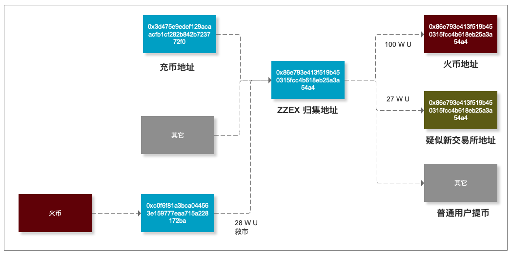

# Addressmonitor
ETH 地址监控产品需求

## 产品说明

ETH 地址监控：通过嗅探并监控交易所或其它区块链应用的主钱包，对项目的安全性评级，帮助用户在平台暴雷前规避资产风险。

### 功能

1. 地址分类：通过 一定时间内 指定币种的 转入笔数、转入金额、转出笔数、转出金额、转入地址来源 与 转出地址 来源几个参数对地址进行分类。

2. 地址标记：将一些特殊地址标记，特殊地址包括：交易所主钱包地址、各种区块链合约地址、涉案地址、各知名人士持有地址等。

3. 地址地图：将地址间的关联以拓扑图形式展示，在图上标注出重要地址。

案列说明：

1. zzex USDT ERC20 充币地址：0x3d475e9edef129acaacfb1cf282b842b723772f0

2. 向该地址充值后，该地址 USDT 被转入 0x86e793e413f519b450315fcc4b618eb25a3a54a4


3. 追踪 0x86e793e413f519b450315fcc4b618eb25a3a54a4 地址，发现给地址为交易所归集地址。
- 该地址于 2019.7.24 日充入 19997 个 USDT
- 至 2019.8.24 该地址 U 为净支出，推测此前充提记录为测试阶段
- 导出  0x86e793e413f519b450315fcc4b618eb25a3a54a4 USDT 交易记录

有 8次 大额提现

- 第二次提现最多


查看该笔交易，挖到 0x19b7ec5ed41fb4c89d6f7b2952c5f70c7874e91a 地址


- 查看 0x19b7ec5ed41fb4c89d6f7b2952c5f70c7874e91a 地址记录，确认该地址为 火币网用户充币地址。


- 2019.11.26 再次提币 30 w U 到 0x19b7ec5ed41fb4c89d6f7b2952c5f70c7874e91a 出售。


- 值得注意的是，2019.12.24 日这一笔提币并没有提到火币，极有可能是提到新交易所。


4. 生成拓扑关系


5. 风控策略


## 核心功能

### 地址标记

地址标记目前通过 [etherscan.io](https://etherscan.io/) 可以查到大部分合约和交易所，不过很多野鸡交易所还没有备案到浏览器中，需要通过【地址嗅探】【用户备案】等手段补全数据。

### 地址分类

通过地址分类找出特殊地址，能发未标记的重要地址，地址分类的标准方案如下：

#### 维度

单个 ETH 地址基本信息 `AddressDetail`:

```go

Transaction struct {
    from byte
    to byte
    value uint
    txid byte
    time uint  
}

AddressDetail struct {
	into []Transactions
	out []Transactions
	balance uint
	token byte
}

```

#### 路径


通过筛选大额进出地址，追踪资金流向。

```go

Input struct {
    value uint
    address byte
    perc float64
}

Output struct {
    value uint
    address byte
    perc float64
}

AddressPath struct {
    input []Input
    output []Output
}

```

#### 路径追溯


## 产品计划

### 0.0 Star

#### 分析流程

0. 地址嗅探

|交易所|币种|嗅探地址|提币费|提币限制|
|--|--|--|--|--|
|[CITEX](https://www.citex.co.kr/)|USDT|0x38dbb30c48aea509db36a09d3ffada9443e8fd81|2|(50, --)|
|[ZZEX](https://www.zzexvip.com/)|USDT|0x3d475e9edef129acaacfb1cf282b842b723772f0|2|(--, --)|
|[BIKI](https://www.biki.com/)|USDT|0xf88113960bc952f263e8415ba680ef3365ce28fd|3|(--, 1500)|
|[ZG](https://zg.com/)|USDT|0x73652c7dea15558fb3e5ff0f32f63b2ae2f1e2a3|2|(7, 150002)|

1. 给定目标地址
2. 检索特殊关系地址
3. 检索特殊关系地址的特殊关系地址
4. 遇到标记地址停止检索
5. 遇到中转地址标注并停止

#### 模板要素

1. 监控币种
2. 监控地址
3. 当前余额
4. 关系图
    * 地址
    * 方向
    * 数量
    * 标记
5. 分析报告

#### 标记分类

1. 知名大地址：已被各大网站标注
2. 中转地址：大资金高频率每日进出
3. 普通地址：小资金低频率

### 0.1 Beta

目标：可快速分析地址并生成报告

时间：15 天

功能：【地址交易记录查询】【特殊地址标记】【关系图】【特殊地址提交】


