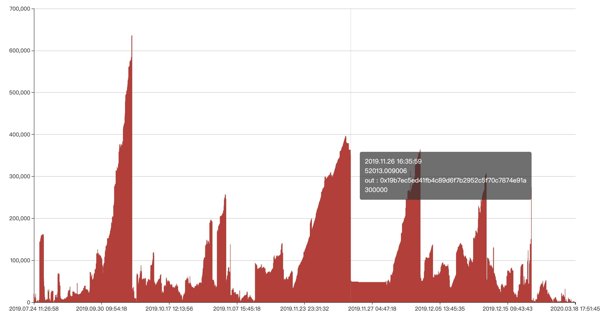
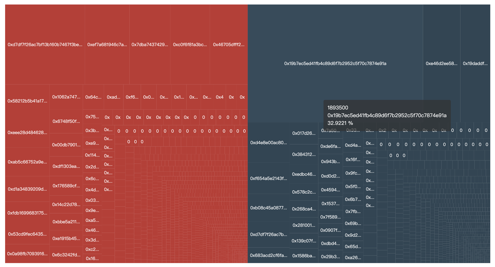

# 交易所地址分析报告

该报告保证可观公正的分析 [ZZEX](https://www.zzexvip.com/) 交易所钱包中的 USDT 流动性，对交易所风险评级，供用户参考。

报告目录：
- [结论](#结论)
- [近 5 日经营数据](#近5日经营数据)
- [历史经营数据](#历史经营数据)
- [余额变动趋势](#余额变动趋势)
- [交易关系](#交易关系)
- [大额关系地址列表](#大额关系地址列表)
- [大额地址拓扑图](#大额地址拓扑图)
- [分析结论](#分析结论)

## 结论

制表截止时间：2020.3.19 10:25
|指标|数据|等级|说明|
|--|--|--|--|
|账户地址|0x86e793e413f519b450315fcc4b618eb25a3a54a4|正常|--|
|账户U余额|185.1069|危险|用过链上数据查询，账户余额低于10000，提币困难|
|账户估值值|$3385.2463|危险|仅计算排名前10的数字资产价值，账户估值低于$10000，经营困难|
|活跃度|0|危险|已该币种|
|提现难度|4|非常困难|[ 0, 5 ] 数值越高提现越困，5 为无法提现 |
|风险评级|DDD|极高风险|A+最优，DDD 为最高风险|

## 相关数据

### 近5日经营数据

|指标|参数|评级|说明|
|--|--|--|--|
|5日累积【提U】【数量】|972.2759|极低||
|5日累积【提U】【笔数】|3|极低||
|5日累积【提U】【地址数量】|3|极低||
|5日累积【充U】【数量】|1251.528195|极低||
|5日累积【充U】【笔数】|6|极低||
|5日累积【充U】【地址数量】|5|极低||
|5日【充/提 U】|0.77687|入金||

> 笔数 / 地址数 ： 复充率

### 历史经营数据

|指标|参数|评级|说明|
|--|--|--|--|
|提U【数量】|5751000.5669|||
|提U【笔数】|1729|||
|提U【地址数】|1061|||
|充U【数量】|5751429.2886|||
|充U【笔数】|3431|||
|充U【地址数】|1627|||

### 余额变动趋势图

### 交易地址占比图

红色充值地址，灰色为提币地址

### 大额关系地址列表

|地址|交易类型|地址类型|交易数量|占比|
|--|--|--|--|--|
|0x19b7ec5ed41fb4c89d6f7b2952c5f70c7874e91a|提现||1893500|32.92 %|
|0xe46d2ee587e57dd4b14919a481068326126979bc|提现||403403|7.01 %|
|0x19daddf624f9ec9a39efc3807fbd94a557192557|提现||323605|5.63 %|
|0xd4e8e00ac8045ec24328a78eb46a76120547009d|提现||155269.6514|2.70 %|
|0xf654a5e2143f6c0289aa6da39807fe148ff9880a|提现||120000|2.09 %|
|0xb08c45a08778993fb7792927a3a3f2c819784135|提现||105997.1606|1.84 %|
|0xd7df7f26ac7bf13b160b7467f3be7663427a0d66|提现||100000|1.74 %|
|0x683acd2cf6fa6f5289172f96176a9e8ab5018482|提现||60000|1.04 %|
|0x017d2670a2f19c2cad6f1033d86bbfc7c8287620|提现||57673.5344|1.00 %|
|0x3843128ef64af567c2e234df678337249123c61e|提现||53324.2936|0.93 %|
|0xedbc466ff04a28eb2dc286a8a482ae73f5b94c7b|提现||50195|0.87 %|
|0x578c2c4bb72f8c6fab01fd096cb68e3c3d253fab|提现||44312.4585|0.77 %|
|0x268ca4e7025f14f3e103fb47d8e3cb5115a58d20|提现||44199.3304|0.77 %|
|0x281001894f2350921a9bdf48045d65ce67bcbd56|提现||41617.877|0.72 %|
|0x139c07f5aadfedb11a7b189e6fa7c5627f8fb15e|提现||40155|0.70 %|
|0x1586baa298418f7457fe369bc4b40ec5e5b29f07|提现||38542.17|0.67 %|
|0x7a5048312f31c9e950a20ed61d0cff9de68477e8|提现||36626|0.64 %|
|0xde6fa1fbd02831a3167a2d92473279ce49ee8676|提现||34549.9375|0.60 %|
|0x943b7634d2321ae86be4d1e43ba9881b9d51803d|提现||33810|0.59 %|
|0xd0d2cc1b27f2262419390489d26c6b0a9341ee61|提现||31498.9213|0.55 %|
|0xd7df7f26ac7bf13b160b7467f3be7663427a0d66|充值||584157.01415|10.16 %|
|0xef7a681946c7ad893170d7cc37bfc4626891990e|充值||325452.680938|5.66 %|
|0x7dba7437429753437adb5cd74a0bedd09326564e|充值||298173.155487|5.18 %|
|0xc0f6f81a3bca044563e159777eaa715a228172ba|充值||289444|5.03 %|
|0x46705dfff24256421a05d056c29e81bdc09723b8|充值||277095.0557|4.82 %|
|0x58212b5b41a17021800a1e6880e0f80083a9c705|充值||135002|2.35 %|
|0xeee28d484628d41a82d01e21d12e2e78d69920da|充值||121387.001421|2.11 %|
|0xab5c66752a9e8167967685f1450532fb96d5d24f|充值||117991.432663|2.05 %|
|0xd1a34839209d25e3506eb35500277f27138e0687|充值||104009.718002|1.81 %|
|0xfdb16996831753d5331ff813c29a93c76834a0ad|充值||90824|1.58 %|
|0x53cd9fec64352665826567ee951a0dc1d3ff4d4d|充值||82059.5|1.43 %|
|0x0a98fb70939162725ae66e626fe4b52cff62c2e5|充值||77052.282668|1.34 %|
|0x1062a747393198f70f71ec65a582423dba7e5ab3|充值||75781.754638|1.32 %|
|0x6748f50f686bfbca6fe8ad62b22228b87f31ff2b|充值||72995|1.27 %|
|0x00db79015ce07f644a7a594de89b6b9647632020|充值||70445.900582|1.22 %|
|0xdf1303ea6a97cee4747b71a8180cc55e5ba145fb|充值||60000|1.04 %|
|0x176589cfb07178104f35400820916e9c73d8f7d3|充值||59394.5|1.03 %|
|0x14c22d78993bae32a470fb6e2037bf6f5e425ca4|充值||54126|0.94 %|
|0xbbe5a211b8efb578b4f2ce1de7e6c785abf622f3|充值||51718.802171|0.90 %|
|0xe1915b45d3a45d3b9482ad6d188f375e91bb653d|充值||50000|0.87 %|

### 分析结论
